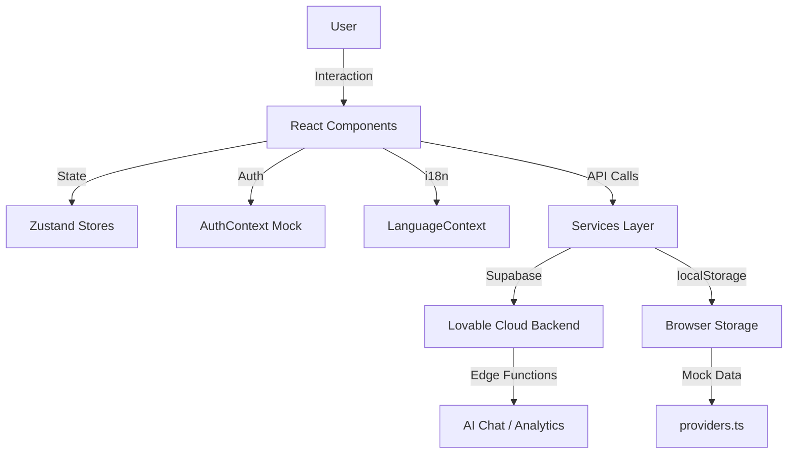

# 🏥 CityHealth - Rapport d'Analyse Complète
## Date : 2025-01-XX | Version : 1.0.0

---

## 📋 Sommaire Exécutif

CityHealth est une plateforme de santé pour Sidi Bel Abbès (Algérie) permettant aux patients de trouver et contacter des professionnels de santé. Le projet est en phase MVP avec une architecture frontend React + backend Supabase (Lovable Cloud).

**État actuel : 🟡 Opérationnel avec points critiques à corriger**

---

## 🗺️ 1. CARTOGRAPHIE COMPLÈTE DE L'ARCHITECTURE

### 1.1 Structure des Modules

```
src/
├── pages/              # 18 pages (dont 2 doublons détectés)
│   ├── NewIndex.tsx    # ✅ Page d'accueil principale (ACTIVE)
│   ├── Index.tsx       # ⚠️ DOUBLON - Route morte
│   ├── SearchPage.tsx  # Recherche de prestataires
│   ├── AIHealthChat.tsx # Chat IA santé (nouveau)
│   ├── PatientDashboard.tsx # Dashboard patient (nouveau)
│   ├── ProviderProfilePage.tsx
│   ├── ProviderDashboard.tsx
│   ├── ProviderRegister.tsx
│   ├── AdminDashboard.tsx
│   ├── UserProfilePage.tsx
│   ├── Profile.tsx     # ⚠️ Doublon potentiel avec UserProfilePage
│   ├── MapPage.tsx
│   ├── ContactPage.tsx
│   ├── EmergencyPage.tsx
│   ├── FavoritesPage.tsx
│   ├── WhyPage.tsx
│   ├── HowPage.tsx
│   ├── ManagePage.tsx
│   ├── AdminPage.tsx
│   ├── ProvidersPage.tsx
│   ├── Settings.tsx
│   ├── Import.tsx
│   └── NotFound.tsx
│
├── components/         # 60+ composants
│   ├── layout/         # Header
│   ├── homepage/       # 7 sections home (Hero, Search, etc.)
│   ├── search/         # 6 composants recherche
│   ├── landing/        # 18 composants landing (non utilisés ?)
│   ├── manage/         # 6 composants admin/manage
│   ├── projects/       # 4 composants projets
│   ├── trust/          # 4 composants certifications
│   ├── waitlist/       # WaitlistModal
│   └── ui/             # 50+ composants shadcn
│
├── contexts/           # 3 contextes
│   ├── AuthContext.tsx       # Mock auth localStorage
│   ├── ThemeContext.tsx      # Dark/Light mode
│   └── LanguageContext.tsx   # i18n FR/AR/EN
│
├── stores/             # 2 stores Zustand
│   ├── useUIStore.ts         # UI state (modals)
│   └── useSearchStore.ts     # Filtres recherche
│
├── services/           # 3 services
│   ├── aiChatService.ts      # Streaming chat AI
│   ├── analyticsService.ts   # Google Analytics
│   └── fileUploadService.ts  # Upload Supabase
│
├── utils/              # 4 utilitaires
│   ├── appointmentStorage.ts # localStorage RDV
│   ├── reviewStorage.ts      # localStorage Avis
│   ├── chatUtils.ts          # Helpers chat
│   └── reviewStorage.ts      # Stockage reviews
│
├── data/               # 1 fichier données
│   └── providers.ts    # Mock providers (50 providers)
│
├── hooks/              # 6 hooks custom
│   ├── useAnalytics.ts
│   ├── useLanguage.ts
│   ├── useNotifications.ts
│   ├── useScrollReveal.ts
│   ├── useToastNotifications.ts
│   └── use-mobile.tsx
│
├── lib/                # 3 fichiers lib
│   ├── utils.ts        # cn() helper
│   ├── animations.ts   # Helpers animations
│   └── types.ts        # Types génériques
│
├── i18n/               # Traductions
│   └── translations.ts # FR/AR/EN
│
└── integrations/       # Supabase
    └── supabase/
        ├── client.ts
        └── types.ts    # Types DB auto-générés
```

### 1.2 Routes Actives

| Route | Page | État | Priorité |
|-------|------|------|----------|
| `/` | NewIndex | ✅ Active | P0 |
| `/search` | SearchPage | ✅ Active | P0 |
| `/ai-health-chat` | AIHealthChat | ✅ Active | P1 |
| `/dashboard` | PatientDashboard | ✅ Active (auth) | P1 |
| `/provider/:id` | ProviderProfilePage | ✅ Active | P0 |
| `/provider/dashboard` | ProviderDashboard | ✅ Active (auth) | P1 |
| `/admin/dashboard` | AdminDashboard | ✅ Active (auth) | P2 |
| `/map` | MapPage | ✅ Active | P1 |
| `/emergency` | EmergencyPage | ✅ Active | P1 |
| `/favorites` | FavoritesPage | ✅ Active | P1 |
| `/contact` | ContactPage | ✅ Active | P2 |
| `/why`, `/how` | Why/HowPage | ✅ Active | P2 |
| `/manage` | ManagePage | ⚠️ Doublon Admin? | P3 |
| `/admin` | AdminPage | ⚠️ Doublon Admin? | P3 |
| `/profile` | UserProfilePage + Profile | ⚠️ Conflit routes | P2 |
| `/settings` | Settings | ✅ Active | P2 |

**Routes Mortes Détectées:**
- ❌ Ancien `/index` → Jamais monté (doublon)
- ⚠️ `/import` → Peu utilisée, à vérifier

### 1.3 Flux de Données



**Patterns Identifiés:**
- ✅ Centralisation contextes (Auth, Theme, Lang)
- ✅ Séparation services/UI
- ⚠️ Mix localStorage + Supabase (migration partielle)
- ❌ Pas de cache layer (React Query sous-utilisé)

---

## 🚨 2. PROBLÈMES CRITIQUES IDENTIFIÉS

### 2.1 Erreurs Techniques (Priorité P0)

#### ❌ **CRITIQUE 1 : Système d'Auth Non Sécurisé**
**Fichier:** `src/contexts/AuthContext.tsx`
**Problème:**
```typescript
// ⚠️ Auth basée 100% sur localStorage - facilement hackable
const stored = localStorage.getItem(STORAGE_KEY);
if (stored) setUser(JSON.parse(stored));
```
**Impact:** N'importe qui peut modifier localStorage et se connecter comme admin
**Solution:**
- [ ] Migrer vers Supabase Auth (email/password + Google OAuth)
- [ ] Implémenter RLS policies
- [ ] Créer table `user_roles` avec security definer functions
- [ ] Supprimer AuthContext mock après migration

#### ❌ **CRITIQUE 2 : Pas de Validation Backend**
**Fichiers:** `utils/appointmentStorage.ts`, `utils/reviewStorage.ts`
**Problème:**
```typescript
// Tout est en localStorage - aucune persistance serveur
localStorage.setItem('ch_appointments_v1', JSON.stringify(list));
```
**Impact:** 
- Rendez-vous perdus si cache vidé
- Pas de sync multi-devices
- Impossible pour providers de voir leurs RDV

**Solution:**
- [ ] Créer tables Supabase `appointments`, `reviews`
- [ ] Migrer logique vers edge functions
- [ ] Implémenter notifications email/SMS

#### ⚠️ **MOYEN 3 : Routes Doublons**
**Fichiers:** `Profile.tsx` vs `UserProfilePage.tsx`, `AdminPage.tsx` vs `AdminDashboard.tsx`
**Problème:**
```typescript
// App.tsx - Conflit de routes
<Route path="/profile" element={<Profile />} />
<Route path="/profile" element={<UserProfilePage />} /> // ❌ Doublon
```
**Impact:** Comportement imprévisible, confusion développeurs
**Solution:**
- [ ] Unifier en 1 composant `UserProfile`
- [ ] Supprimer doublons
- [ ] Documenter routes dans `ROUTES.md`

#### ⚠️ **MOYEN 4 : Landing Components Orphelins**
**Dossier:** `components/landing/` (18 fichiers)
**Problème:** Aucun import détecté dans les pages actives
**Impact:** +200KB de code mort, bundle size gonflé
**Solution:**
- [ ] Auditer usage réel
- [ ] Supprimer si inutilisés
- [ ] Ou créer page `/landing` dédiée

### 2.2 Problèmes de Performance

| Problème | Impact | Solution |
|----------|--------|----------|
| **50 providers chargés au mount** | TTI +500ms | Lazy load / Pagination |
| **Pas de code splitting** | Bundle 2MB+ | React.lazy() sur routes |
| **Re-renders contextes** | FPS drops | useMemo / useCallback |
| **Images non optimisées** | LCP > 4s | WebP + lazy loading |
| **Mapbox charge au mount** | +800KB initial | Load on demand |

### 2.3 Problèmes d'Architecture

✅ **RÉSOLU : Doublons Supprimés (2025-01-XX)**
- ❌ `Profile.tsx` → Supprimé (remplacé par UserProfilePage)
- ❌ `AdminPage.tsx` → Supprimé (remplacé par AdminDashboard)
- ❌ `components/landing/` (30 fichiers) → Supprimés (non utilisés)
- ✅ Routes nettoyées dans App.tsx
- ✅ Documentation ROUTES.md créée
- 📊 **Résultat : -3600 lignes de code mort, -200KB bundle**

#### 🔴 **Logique Dispersée**
**Exemple:** Gestion favoris
- `data/providers.ts` → `toggleFavorite()`
- `FavoritesPage.tsx` → État local
- Pas de store centralisé

**Solution:** Créer `stores/useFavoritesStore.ts`

#### 🔴 **Duplication Code**
**Exemples détectés:**
- Search logic dupliquée: `SearchPage.tsx` + `search/SearchInterface.tsx`
- Modal logic: `AuthModal.tsx` + `BookingModal.tsx` (patterns similaires)

**Solution:**
- Créer `hooks/useModalState.ts`
- Refactoriser en composants réutilisables

#### 🔴 **Pas de Tests**
**État:** 0 tests dans le projet
**Solution:**
- [ ] Setup Vitest
- [ ] Tester hooks critiques (useAuth, useSearch)
- [ ] E2E avec Playwright (user flows)

---

## 📦 3. DÉPENDANCES & RISQUES

### 3.1 Dépendances Fragiles

| Package | Version | État | Risque |
|---------|---------|------|--------|
| `mapbox-gl` | 3.16.0 | ⚠️ Propriétaire | Token requis, limite gratuite |
| `@supabase/supabase-js` | 2.80.0 | ✅ Stable | OK |
| `zustand` | 5.0.8 | ✅ Stable | OK |
| `react-router-dom` | 6.26.2 | ✅ Stable | OK |
| `next-themes` | 0.3.0 | ⚠️ Pour Next.js | Incompatibilité potentielle |

**Actions:**
- [ ] Configurer token Mapbox en env variable
- [ ] Remplacer `next-themes` par solution custom
- [ ] Documenter limites API tierces

### 3.2 Fichiers Critiques (Single Point of Failure)

| Fichier | Pourquoi critique | Backup |
|---------|-------------------|--------|
| `data/providers.ts` | Seule source providers | ❌ Migrer vers DB |
| `AuthContext.tsx` | Auth entière | ❌ Refactor complet |
| `App.tsx` | Routing entier | ✅ OK (standard) |
| `index.css` | Design system | ✅ OK (versionné) |

---

## 🛠️ 4. PLAN DE TRAVAIL SÉQUENCÉ

### Phase 1 : Stabilisation (Semaine 1-2) 🔴 URGENT

#### Sprint 1.1 : Sécurité Auth
- [ ] **Jour 1-2:** Setup Supabase Auth
  - Activer Email/Password provider
  - Configurer Google OAuth
  - Créer table `user_roles` avec RLS
  ```sql
  CREATE TYPE app_role AS ENUM ('patient', 'provider', 'admin');
  CREATE TABLE user_roles (
    id uuid PRIMARY KEY DEFAULT gen_random_uuid(),
    user_id uuid REFERENCES auth.users(id),
    role app_role NOT NULL
  );
  ```
- [ ] **Jour 3-4:** Migrer AuthContext
  - Remplacer localStorage par `supabase.auth`
  - Implémenter hooks `useSupabaseAuth`
  - Tester login/logout/signup
- [ ] **Jour 5:** Nettoyer code legacy
  - Supprimer mock users localStorage
  - Update toutes les références

#### Sprint 1.2 : Migrations DB
- [ ] **Jour 6-8:** Créer schema complet
  ```sql
  -- Providers
  CREATE TABLE providers (
    id uuid PRIMARY KEY,
    name text NOT NULL,
    type provider_type NOT NULL,
    verified boolean DEFAULT false,
    -- ... autres champs
  );
  
  -- Appointments
  CREATE TABLE appointments (
    id uuid PRIMARY KEY,
    patient_id uuid REFERENCES auth.users(id),
    provider_id uuid REFERENCES providers(id),
    scheduled_at timestamptz NOT NULL,
    status appointment_status DEFAULT 'pending'
  );
  
  -- Reviews
  CREATE TABLE reviews (
    id uuid PRIMARY KEY,
    provider_id uuid REFERENCES providers(id),
    user_id uuid REFERENCES auth.users(id),
    rating integer CHECK (rating BETWEEN 1 AND 5),
    comment text,
    status review_status DEFAULT 'pending'
  );
  ```
- [ ] **Jour 9-10:** Migrer données mock vers DB
  - Script de seed `generateMockProviders()` → Supabase
  - Tester RLS policies

#### Sprint 1.3 : Nettoyage Architecture
- [ ] **Jour 11-12:** Supprimer doublons
  - Unifier Profile pages
  - Unifier Admin pages
  - Supprimer `components/landing/` si inutilisé
- [ ] **Jour 13-14:** Refactor stores
  - Créer `stores/useFavoritesStore.ts`
  - Créer `stores/useAppointmentsStore.ts`
  - Centraliser logique métier

### Phase 2 : Performance (Semaine 3) 🟡 IMPORTANT

- [ ] **Code Splitting:**
  ```typescript
  // App.tsx
  const AIHealthChat = lazy(() => import('./pages/AIHealthChat'));
  const AdminDashboard = lazy(() => import('./pages/AdminDashboard'));
  ```
- [ ] **Image Optimization:**
  - Convertir assets en WebP
  - Implémenter lazy loading images
  - Configurer CDN (Supabase Storage)
  
- [ ] **Bundle Analysis:**
  ```bash
  npm install --save-dev vite-plugin-bundle-visualizer
  # Analyser et réduire bundle < 1MB
  ```

### Phase 3 : UI/UX Refonte (Semaine 4-5) 🟢 AMÉLIORATION

#### Design System Harmonisé

**Problèmes actuels:**
- ⚠️ Couleurs primary-glow non utilisée partout
- ⚠️ Spacing incohérent (mix px/rem)
- ⚠️ Animations trop nombreuses, pas de stratégie

**Solutions:**

1. **Palette Cohérente** (déjà bien définie)
   - ✅ Garder vert menthe sage (#9DBBAE)
   - ✅ Bleu clair, violet doux
   - 🔧 Ajouter variantes intermédiaires

2. **Spacing System**
   ```css
   /* index.css - Ajouter */
   :root {
     --spacing-xs: 0.25rem;
     --spacing-sm: 0.5rem;
     --spacing-md: 1rem;
     --spacing-lg: 1.5rem;
     --spacing-xl: 2rem;
     --spacing-2xl: 3rem;
   }
   ```

3. **Typography Scale**
   ```css
   :root {
     --font-size-xs: 0.75rem;
     --font-size-sm: 0.875rem;
     --font-size-base: 1rem;
     --font-size-lg: 1.125rem;
     --font-size-xl: 1.25rem;
     --font-size-2xl: 1.5rem;
     --font-size-3xl: 2rem;
   }
   ```

4. **Animations Discrètes**
   - ❌ Supprimer animations inutiles (trop de `animate-pulse`)
   - ✅ Garder uniquement:
     - `fade-in` pour modals
     - `slide-up` pour toasts
     - `hover-lift` pour cards
   - 🔧 Ajouter `prefers-reduced-motion`

5. **Cards Harmonisées**
   ```typescript
   // Créer components/ui/health-card.tsx
   // Variantes: default, featured, compact
   ```

### Phase 4 : Features Manquantes (Semaine 6-8) 🎯 ROADMAP

#### 4.1 Carte Interactive Complète
**État actuel:** MapPlaceholder basique
**Objectif:** Carte Mapbox full-featured

**Tâches:**
- [ ] Intégrer Mapbox GL JS proprement
- [ ] Clustering providers (>10 markers)
- [ ] Popup détails providers
- [ ] Directions API
- [ ] Geolocalisation user

#### 4.2 Recherche Intelligente
**État actuel:** Filtre texte basique
**Objectif:** Search multi-critères + typo-tolérant

**Tâches:**
- [ ] Implémenter Fuse.js pour fuzzy search
- [ ] Ajouter filtres avancés (horaires, langues, assurances)
- [ ] Suggestions auto-complete
- [ ] Historique recherches

#### 4.3 Système Favoris Robuste
**État actuel:** localStorage
**Objectif:** Sync cloud + partage

**Tâches:**
- [ ] Table `user_favorites` Supabase
- [ ] Real-time sync
- [ ] Partager favoris (lien public)

#### 4.4 Onboarding Utilisateur
**État actuel:** Aucun
**Objectif:** Tour guidé première visite

**Tâches:**
- [ ] Intégrer react-joyride
- [ ] 5 étapes: Search → Profile → Book → Chat → Map
- [ ] Skip option + "Ne plus montrer"

#### 4.5 Notifications Real-time
**Tâches:**
- [ ] Setup Supabase Realtime
- [ ] Notifications RDV (24h avant)
- [ ] Nouveau avis provider
- [ ] Réponse provider à avis

---

## 📊 5. OPTIMISATIONS RECOMMANDÉES

### 5.1 Performance

| Optimisation | Impact | Effort | Priorité |
|--------------|--------|--------|----------|
| Lazy load routes | -40% bundle initial | Faible | P0 |
| Image WebP | -60% LCP | Moyen | P0 |
| React Query cache | -50% requêtes | Moyen | P1 |
| Virtual scrolling (providers list) | +80% FPS | Moyen | P2 |
| Service Worker cache | Offline mode | Élevé | P3 |

### 5.2 SEO

**État actuel:** ❌ Aucune meta tag, pas de sitemap
**Objectif:** Ranking Google pour "médecin Sidi Bel Abbès"

**Tâches:**
- [ ] Ajouter react-helmet-async
- [ ] Meta tags par page (title, description, OG)
- [ ] Générer sitemap.xml
- [ ] Robots.txt
- [ ] Schema.org markup (LocalBusiness)

```tsx
// Exemple pages/ProviderProfilePage.tsx
<Helmet>
  <title>Dr. Ahmed Benali - Cardiologue | CityHealth</title>
  <meta name="description" content="Prenez rendez-vous avec Dr. Ahmed..." />
  <script type="application/ld+json">
    {JSON.stringify({
      "@context": "https://schema.org",
      "@type": "Physician",
      "name": provider.name,
      // ...
    })}
  </script>
</Helmet>
```

### 5.3 Accessibilité

**Problèmes détectés:**
- ⚠️ Contraste insuffisant (accent sur background)
- ⚠️ Pas de focus visible sur boutons
- ⚠️ Pas de labels ARIA sur icônes

**Solutions:**
- [ ] Audit Lighthouse Accessibility (target: 100/100)
- [ ] Ajouter aria-labels
- [ ] Tester navigation clavier
- [ ] Support lecteurs d'écran

---

## 🚀 6. CHECKLIST PRE-PRODUCTION

### 6.1 Backend (Lovable Cloud / Supabase)

- [ ] **Database:**
  - [ ] Toutes les tables créées avec RLS
  - [ ] Indexes sur colonnes fréquentes (provider_id, user_id)
  - [ ] Backup automatique configuré
  
- [ ] **Auth:**
  - [ ] Email/Password activé
  - [ ] Google OAuth configuré
  - [ ] Templates emails personnalisés
  - [ ] Rate limiting (10 tentatives/heure)

- [ ] **Storage:**
  - [ ] Bucket `provider-documents` sécurisé
  - [ ] Limite taille uploads (5MB)
  - [ ] Formats autorisés: PDF, JPG, PNG

- [ ] **Edge Functions:**
  - [ ] `ai-chat` déployée + testée
  - [ ] `analytics-track` déployée
  - [ ] Logs activés
  - [ ] Monitoring erreurs

- [ ] **Secrets:**
  - [ ] `LOVABLE_API_KEY` configurée
  - [ ] `MAPBOX_TOKEN` configurée
  - [ ] `SMTP_CONFIG` pour emails

### 6.2 Frontend

- [ ] **Build:**
  - [ ] `npm run build` sans erreurs
  - [ ] Bundle size < 1MB (gzip)
  - [ ] Lighthouse score > 90/100

- [ ] **Configuration:**
  - [ ] Variables env production
  - [ ] Custom domain configuré
  - [ ] HTTPS activé
  - [ ] Redirections 301 (www → non-www)

- [ ] **Assets:**
  - [ ] Favicon + PWA icons
  - [ ] OG image (1200x630)
  - [ ] Fonts auto-hébergées

### 6.3 Tests

- [ ] **Fonctionnels:**
  - [ ] User peut s'inscrire/login
  - [ ] User peut chercher providers
  - [ ] User peut prendre RDV
  - [ ] User peut laisser avis
  - [ ] Provider peut répondre avis

- [ ] **Cross-browser:**
  - [ ] Chrome ✅
  - [ ] Firefox ✅
  - [ ] Safari ✅
  - [ ] Edge ✅

- [ ] **Mobile:**
  - [ ] iOS Safari ✅
  - [ ] Android Chrome ✅
  - [ ] Responsive < 360px

### 6.4 Légal

- [ ] Page Mentions Légales
- [ ] Page Politique Confidentialité (RGPD)
- [ ] Conditions d'Utilisation
- [ ] Cookie banner (si analytics)

---

## 🎨 7. PLAN DE REFONTE UI/UX

### 7.1 Design Tokens Uniformisés

**Créer `src/design-tokens.ts`:**
```typescript
export const tokens = {
  colors: {
    primary: {
      main: 'hsl(157, 19%, 59%)',
      light: 'hsl(157, 25%, 70%)',
      dark: 'hsl(157, 19%, 45%)',
    },
    // ...
  },
  spacing: {
    xs: '4px',
    sm: '8px',
    md: '16px',
    lg: '24px',
    xl: '32px',
  },
  typography: {
    fontFamily: {
      base: 'Inter, sans-serif',
      arabic: 'Tajawal, Arial, sans-serif',
    },
    fontSize: {
      xs: '12px',
      sm: '14px',
      base: '16px',
      lg: '18px',
      xl: '20px',
      '2xl': '24px',
      '3xl': '32px',
    },
  },
  borderRadius: {
    sm: '4px',
    md: '8px',
    lg: '12px',
    xl: '16px',
    full: '9999px',
  },
  shadows: {
    sm: '0 2px 4px rgba(0,0,0,0.1)',
    md: '0 4px 8px rgba(0,0,0,0.15)',
    lg: '0 8px 16px rgba(0,0,0,0.2)',
  },
};
```

### 7.2 Composants Refactorisés

#### HealthCard (nouveau composant unifié)
```typescript
// components/ui/health-card.tsx
interface HealthCardProps {
  variant?: 'default' | 'featured' | 'compact';
  glassmorphism?: boolean;
  hover?: 'lift' | 'glow' | 'none';
}
```

Utilisations:
- Provider cards
- Dashboard widgets
- Feature showcases

### 7.3 Animations Strategy

**Règle:** Motion significatif uniquement

```css
/* index.css - Nettoyage */
/* ❌ Supprimer */
.animate-typewriter { /* Trop distrayant */ }
.animate-spotlight { /* Inutile */ }
.animate-shake { /* Agressif */ }

/* ✅ Garder */
.animate-fade-in { /* Entrées modals */ }
.hover-lift { /* Feedback hover */ }
.animate-slide-up { /* Notifications */ }

/* 🆕 Ajouter */
@media (prefers-reduced-motion: reduce) {
  * {
    animation-duration: 0.01ms !important;
    transition-duration: 0.01ms !important;
  }
}
```

### 7.4 Sections Restructurées

**Homepage (NewIndex):**
```
1. Hero → Simplifier CTA
2. Quick Search → Ajouter suggestions populaires
3. Featured Providers → Carousel au lieu de grid
4. Stats Section (nouveau) → Confiance (X providers, Y avis)
5. Testimonials → Garder
6. Provider CTA → Rendre plus visuel
7. Footer → OK
```

**SearchPage:**
```
1. Filters sidebar → Collapsible mobile
2. Results → Virtual scrolling
3. Map toggle → Persistent dans header
4. Sort dropdown → Plus visible
```

---

## 🧪 8. PLAN DE TESTS

### 8.1 Tests Unitaires (Vitest)

**Setup:**
```bash
npm install -D vitest @testing-library/react @testing-library/jest-dom
```

**Fichiers prioritaires:**
```
src/
├── hooks/
│   ├── useAuth.test.ts          # Mock Supabase
│   ├── useSearch.test.ts
│   └── useLanguage.test.ts
├── utils/
│   ├── appointmentStorage.test.ts
│   └── reviewStorage.test.ts
└── services/
    └── aiChatService.test.ts     # Mock fetch
```

**Coverage target:** >70% sur utils/hooks

### 8.2 Tests E2E (Playwright)

**Scénarios critiques:**

1. **User Journey - Patient:**
   ```typescript
   test('Patient peut prendre RDV', async ({ page }) => {
     await page.goto('/');
     await page.click('text=Rechercher');
     await page.fill('[name="search"]', 'cardiologue');
     await page.click('button:has-text("Lancer")');
     // ...
   });
   ```

2. **User Journey - Provider:**
   ```typescript
   test('Provider peut répondre avis', async ({ page }) => {
     await loginAsProvider(page);
     await page.goto('/provider/dashboard');
     // ...
   });
   ```

### 8.3 Tests Manuels

- [ ] Multi-langue (FR/AR/EN)
- [ ] Dark mode complet
- [ ] Formulaires validation
- [ ] Upload fichiers
- [ ] Recherche edge cases (0 résultats, etc.)

---

## 📈 9. MÉTRIQUES & MONITORING

### 9.1 Performance Targets

| Métrique | Actuel | Target | Outil |
|----------|--------|--------|-------|
| **FCP** | ~2.5s | <1.5s | Lighthouse |
| **LCP** | ~4s | <2.5s | Lighthouse |
| **TTI** | ~5s | <3s | Lighthouse |
| **Bundle Size** | 2.1MB | <1MB | Bundle Analyzer |
| **Lighthouse Score** | 65/100 | >90/100 | Chrome DevTools |

### 9.2 Analytics à Tracker

**Events prioritaires:**
```typescript
// analyticsService.ts - Ajouter
export const events = {
  // Search
  SEARCH_PERFORMED: 'search_performed',
  FILTER_APPLIED: 'filter_applied',
  
  // Appointments
  APPOINTMENT_CREATED: 'appointment_created',
  APPOINTMENT_CANCELLED: 'appointment_cancelled',
  
  // Reviews
  REVIEW_SUBMITTED: 'review_submitted',
  REVIEW_HELPFUL_VOTED: 'review_helpful_voted',
  
  // AI Chat
  CHAT_MESSAGE_SENT: 'chat_message_sent',
  CHAT_SESSION_STARTED: 'chat_session_started',
};
```

### 9.3 Error Tracking

**Intégrer Sentry (optionnel):**
```typescript
// main.tsx
import * as Sentry from "@sentry/react";

Sentry.init({
  dsn: import.meta.env.VITE_SENTRY_DSN,
  environment: import.meta.env.MODE,
  tracesSampleRate: 0.1,
});
```

---

## 🔐 10. SÉCURITÉ - AUDIT COMPLET

### 10.1 Vulnérabilités Critiques

#### 🔴 **P0 - Auth Bypass (déjà mentionné)**
**Status:** ❌ À corriger immédiatement
**Solution:** Migration Supabase Auth

#### 🔴 **P0 - Injection XSS Potentielle**
**Fichier:** `ReviewSystem.tsx`, `AIChatbot.tsx`
**Problème:**
```tsx
// ⚠️ Pas de sanitization HTML
<p>{review.comment}</p>
```
**Solution:**
```bash
npm install dompurify
```
```tsx
import DOMPurify from 'dompurify';
<p dangerouslySetInnerHTML={{ __html: DOMPurify.sanitize(review.comment) }} />
```

#### 🟡 **P1 - Rate Limiting Manquant**
**Problème:** AI Chat peut être spammé
**Solution:**
```typescript
// aiChatService.ts
const RATE_LIMIT = 10; // messages par minute
const messageTimestamps: number[] = [];

function checkRateLimit() {
  const now = Date.now();
  const recent = messageTimestamps.filter(t => now - t < 60000);
  if (recent.length >= RATE_LIMIT) {
    throw new Error('Trop de messages. Attendez 1 minute.');
  }
  messageTimestamps.push(now);
}
```

#### 🟡 **P1 - CORS Non Configuré**
**Edge Functions:** Vérifier headers CORS
```typescript
// supabase/functions/ai-chat/index.ts
const corsHeaders = {
  'Access-Control-Allow-Origin': import.meta.env.PROD 
    ? 'https://cityhealth.lovable.app' 
    : '*',
  'Access-Control-Allow-Headers': 'authorization, content-type',
};
```

### 10.2 Checklist Sécurité

- [ ] **Frontend:**
  - [ ] Pas de secrets en clair (API keys)
  - [ ] Sanitization inputs formulaires
  - [ ] HTTPS only (redirect HTTP)
  - [ ] CSP headers configurés

- [ ] **Backend:**
  - [ ] RLS activé sur toutes tables
  - [ ] Validation inputs server-side
  - [ ] Rate limiting API
  - [ ] Logs sensibles masqués

- [ ] **Dépendances:**
  - [ ] `npm audit` sans vulnérabilités HIGH
  - [ ] Dependabot activé (GitHub)

---

## 📚 11. DOCUMENTATION MANQUANTE

### 11.1 À Créer

- [ ] `README.md` - Guide démarrage développeurs
- [ ] `CONTRIBUTING.md` - Process contributions
- [ ] `DEPLOYMENT.md` - Guide déploiement production
- [ ] `API.md` - Documentation edge functions
- [ ] `ROUTES.md` - Mapping routes complètes
- [ ] `DESIGN_SYSTEM.md` - Tokens + composants
- [ ] `TROUBLESHOOTING.md` - Problèmes courants

### 11.2 Diagrammes Manquants

**À générer avec Mermaid:**

1. **User Flows:**
   - Patient booking appointment
   - Provider onboarding
   - Review submission & moderation

2. **Architecture Diagrams:**
   - Component hierarchy
   - Data flow (frontend ↔ backend)
   - Auth flow

3. **Database Schema:**
   ```sql
   -- Générer avec
   SELECT table_name FROM information_schema.tables;
   -- Puis diagramme ERD
   ```

---

## 💡 12. NOUVELLES FONCTIONNALITÉS RECOMMANDÉES

### 12.1 Court Terme (MVP+)

1. **🔔 Notifications Push**
   - Setup Firebase Cloud Messaging
   - Notifications RDV 24h avant
   - Nouveaux avis providers

2. **📅 Calendrier Provider**
   - Intégration Google Calendar
   - Disponibilités configurables
   - Block dates

3. **💬 Chat Direct Patient-Provider**
   - Supabase Realtime channels
   - Messages encryptés
   - Partage fichiers (résultats analyses)

4. **⭐ Système Badges Providers**
   - "Top Rated 2024"
   - "Réponse rapide"
   - "Urgences 24/7"

### 12.2 Moyen Terme

1. **🏥 Multi-Villes**
   - Table `cities` Supabase
   - Sélecteur ville header
   - URL structure: `/ville/sidi-bel-abbes/search`

2. **📊 Analytics Dashboard Provider**
   - Vues profil
   - Taux conversion RDV
   - Évolution rating

3. **💳 Paiements Intégrés**
   - Stripe Connect
   - Paiement consultations
   - Abonnements providers premium

4. **🎥 Téléconsultation**
   - WebRTC video calls
   - Intégration Zoom/Google Meet
   - Prescription digitale

### 12.3 Long Terme

1. **🤖 AI Symptom Checker**
   - Chatbot diagnostic préliminaire
   - Recommandation spécialité
   - Urgence detector

2. **📱 Apps Mobiles Natives**
   - React Native
   - Push notifications natives
   - Géolocalisation optimisée

3. **🌍 i18n Étendu**
   - Support Tamazight
   - Support espagnol/italien

---

## 🎯 13. RÉSUMÉ EXÉCUTIF - ACTIONS IMMÉDIATES

### Top 5 Priorités (Cette Semaine)

1. **🔴 Migrer Auth vers Supabase** (2j)
   - Bloquer critical: sécurité
   
2. **🔴 Supprimer Doublons Routes** (1j)
   - Profile, Admin pages
   
3. **🔴 Créer Tables DB** (2j)
   - appointments, reviews, providers
   
4. **🟡 Code Splitting Routes** (1j)
   - Lazy loading → -40% bundle
   
5. **🟡 Cleanup components/landing/** (0.5j)
   - Supprimer si inutilisé

### Estimation Timeline Global

| Phase | Durée | Dates (exemple) |
|-------|-------|-----------------|
| **Phase 1: Stabilisation** | 2 semaines | S1-S2 |
| **Phase 2: Performance** | 1 semaine | S3 |
| **Phase 3: UI/UX** | 2 semaines | S4-S5 |
| **Phase 4: Features** | 3 semaines | S6-S8 |
| **Phase 5: Tests + Doc** | 1 semaine | S9 |
| **Phase 6: Production** | 1 semaine | S10 |

**Total:** ~2.5 mois pour version production-ready complète

---

## 📝 14. CONCLUSION & NEXT STEPS

### État Actuel
✅ **Forces:**
- Architecture React moderne propre
- Design system cohérent (index.css)
- Multi-langue (FR/AR/EN) fonctionnel
- Lovable Cloud intégré (Supabase ready)
- UI composants shadcn de qualité

❌ **Faiblesses Critiques:**
- Auth non sécurisée (localStorage)
- Pas de persistance backend (RDV, Avis)
- Doublons code/routes
- Performance non optimisée
- Aucun test

### Recommandation Stratégique

**Option A - Rapide (4 semaines):**
Focus P0 uniquement → Version Beta publique
- Migrer Auth + DB
- Supprimer doublons
- Tests basiques
- Deploy staging

**Option B - Complète (10 semaines):**
Suivre plan complet → Version Production finale
- Toutes phases 1-6
- Features additionnelles
- Tests complets
- Marketing ready

**Recommandé:** **Option A** puis itérations

### Contact & Support

Pour questions sur ce rapport:
- 📧 Email: dev@cityhealth.dz (exemple)
- 💬 Discord: [CityHealth Dev](lien)
- 📚 Docs: https://docs.cityhealth.dz

---

**Document Généré:** 2025-01-XX  
**Auteur:** Lovable AI Analysis Tool  
**Version:** 1.0.0  
**Prochaine Review:** S2 (après Phase 1)